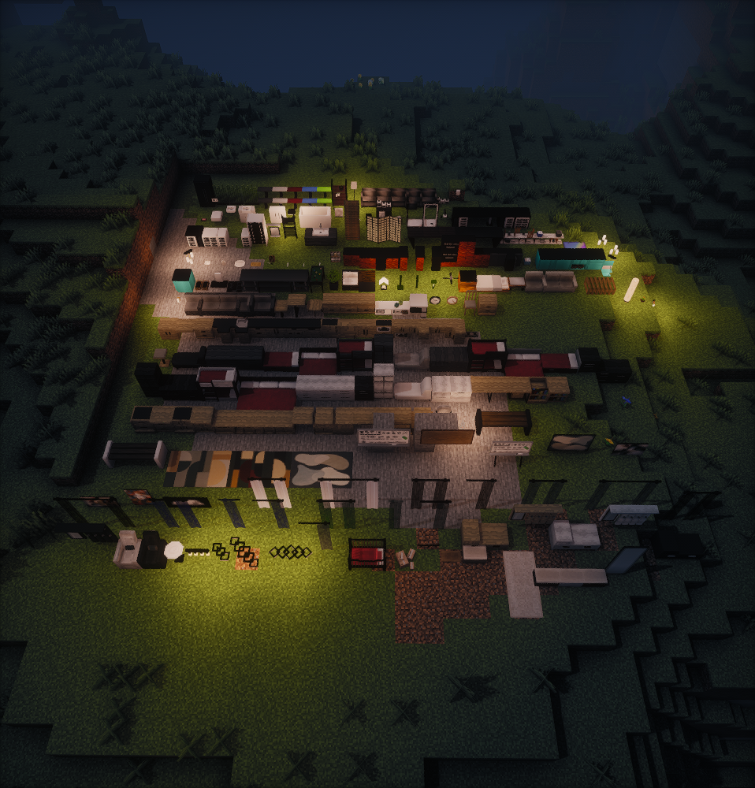
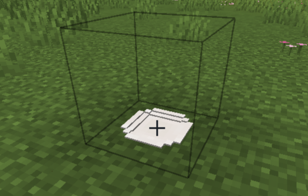
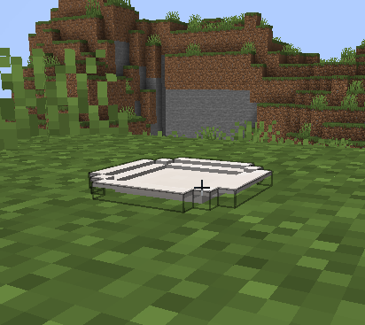

# Modern Furniture Fixed [MFF] (Unofficial Patch)

A fixed version of MDM (Modern Decorations Mod) 26.9 by opaleq for Minecraft 1.20.1 and Forge 47. It replaces MDM: remove MDM and add this mod. It keeps MDM's mod id and every block id, so worlds and buildings made with MDM keep working.

- **Hitboxes that follow the furniture**, for every block.
- **Furniture larger than one block is split into one block per space it fills**, so it collides, lights and hides correctly instead of poking through walls. Placing it places every part, and breaking any part breaks the whole piece.
- **Storage that opens as a vanilla chest**, so sorting buttons and inventory mods work. 108 pieces have storage, with a configurable size, a title that fits the screen, and barrel sounds when it opens and closes.
- **Repaired models**, and the shoe, boot and guitar blocks removed.

The full list, block by block, is in [FIXES.md](FIXES.md).

| MDM | Modern Furniture Fixed |
|---|---|
|  |  |

- Needed on both the client and the server.
- Furniture placed before installing MFF keeps its old look until it is broken and placed again.

## Reason For Existing

MDM's furniture looks good, but its hitboxes, storage screens and some models are broken. This fixes them for modpacks that use it.

### Credit

This is an unofficial patch. [MDM](https://cookiecraftmods.com/) is made by opaleq.

## Settings

- `serverconfig/mdm-server.toml` (per world): `breakWholePiece` (breaking a part breaks the whole piece, default true) and `storageRows` (the storage size of each piece, 1 to 6 rows of 9 slots).
- `config/mdm-client.toml`: `furnitureSounds` (storage open and close sounds, default true).

## How It Works

`tools/furniture_data.py` reads the models and writes `src/main/resources/mff/`: a hitbox for every block state, the parts of split furniture with their own models and offsets, and the storage settings from `tools/furniture_spec.json`. `FurnitureBlock` reads that data for every block. `tools/write_fixes.py` writes FIXES.md from the same data.

## Building

Run `gradlew build`. After changing a model or `tools/furniture_spec.json`, run `python tools/furniture_data.py` and `python tools/write_fixes.py` first (they need Python 3 and numpy).

## License

The changes and additions are 0BSD (`LICENSE`). MDM's own code and assets are under the Academic Free License 3.0 (`NOTICE`).
